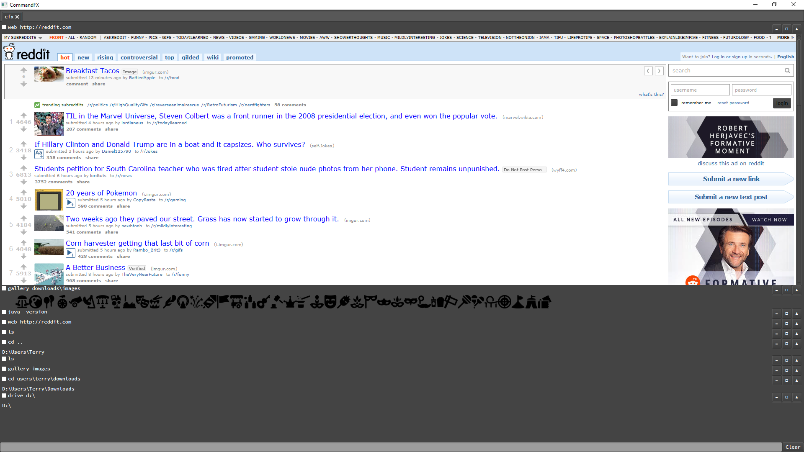

CommandFX
=========
Experimental JavaFX Terminal Emulator

Usage
======
Download and run [CommandFX-0.1.jar](CommandFX-0.1.jar).

Built-In Commands
==================
**`cd {path}`** Change current working directory, `.` and `..` supported.

**`drive {path}`** Change current drive, e.g. `drive d:\`

**`exit`** Quits the program.

**`img {file}`** Displays the image in the terminal.

**`media {file}`** Plays the video or audio in the terminal. (WIP - No media player interface. Videos only play audio.)

**`web {url}`** Opens an embedded browser to the url.

Changes
=======
- Hide button to collapse results.
- Detach button to move results to a new window (returns when window is closed).
- Added a mostly useless gallery command.
- Tabbed terminals

Screen
======

